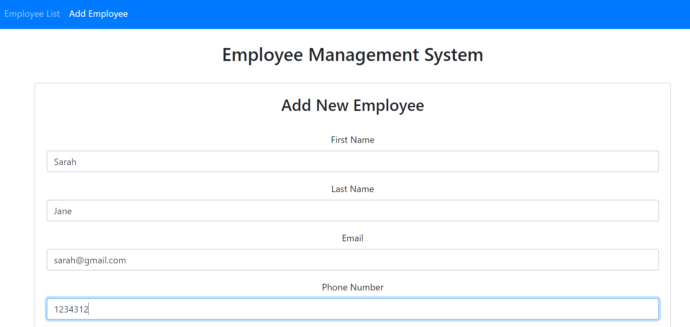
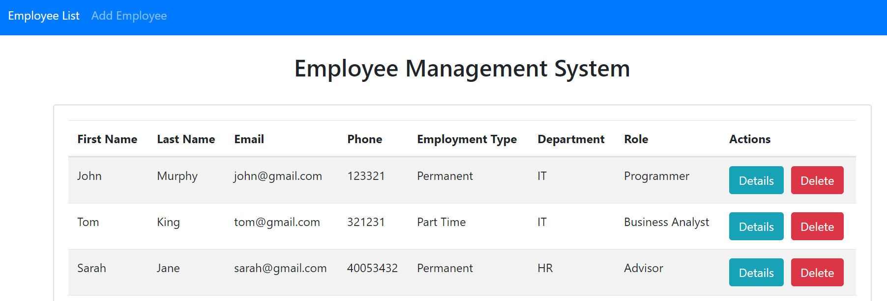
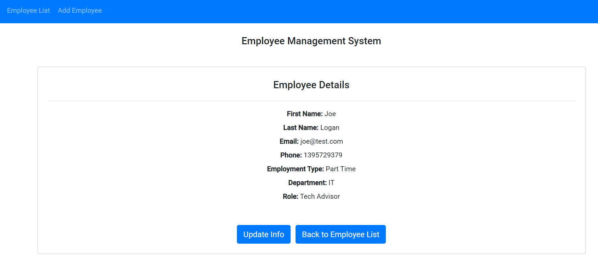

# Employee Management System

AWS link: http://leogorman-employee-client.s3-website-ap-southeast-2.amazonaws.com/employees

Developed via two seperate projects:
- Angular 8 project for front end client
- Spring boot project for back end API
- CRUD style application where you can create/view/delete employees

AWS Deployment:
- Angular project deployed to AWS S3 Bucket
- Spring project deployed to AWS Elastic Beanstalk
- Spring API interacting with MySQL DB set up on AWS RDS 

Screenshots:

Add New Employee

View Employee List

View/Edit Employee

To Do:
- ~~Deploy to cloud platform (AWS/Heroku/Firebase) & update readme with new link~~ 
- ~~Add additional fields to Employee model (start date, department etc..)~~
- ~~Add additional fields to employee profile~~
- Add ability to update employee details
- Search for employees by name/employee id/department/email
- Sort employees by name/dob/id/department
- Add form field restrictions when creating new record

