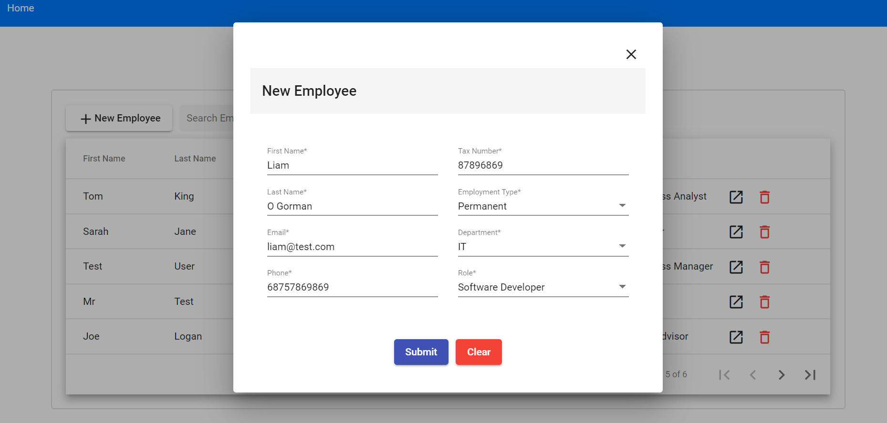

# Employee Management System

CRUD style application where you can create/view/delete employees
- AWS link: http://leogorman-employee-client.s3-website-ap-southeast-2.amazonaws.com/employees

Developed via two seperate projects:
- Angular 8 project for front end client
- Spring boot project for back end API

AWS Deployment:
- Angular project deployed to AWS S3 Bucket
- Spring project deployed to AWS Elastic Beanstalk
- Spring API interacting with MySQL DB set up on AWS RDS 

To Do:
- ~~Deploy to cloud platform (AWS/Heroku/Firebase) & update readme with new link~~ 
- ~~Add additional fields to Employee model (start date, department etc..)~~
- ~~Add additional fields to employee profile~~
- ~~Add Angular Material design to project~~ 
- ~~Add ability to update employee details~~
- ~~Auto refresh data when new employee created~~
- ~~Search for employees by various field(name/employee id/department etc..)~~
- ~~Sort employees by various fields~~
- Add Angular Material design to create + update employee forms
- Add form field restrictions when creating/updating new records
- Add departments dropdown, db table and link to employee table
- Add user login + permissions system 

Screenshots:

View Employee List

Add New Employee

View/Edit Employee

